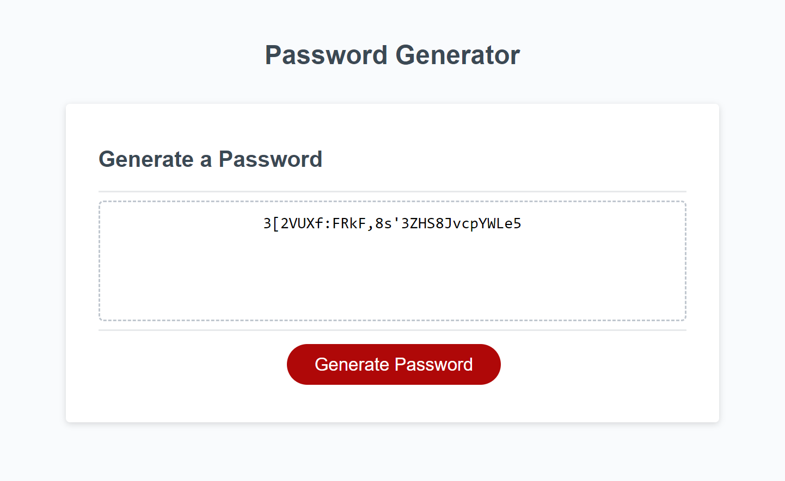

# Password Generator

The challenge for this week is to create a password generator.

Visit the deployed page [here](https://yaszmoon.github.io/FEWDB-week05/).

## User Story

**I WANT** to be able to genrate a random password at the click of a button

**SO THAT** I can meet the criteria on any website with ease

## Acceptance Criteria

When the button is clicked...

Generator must present a series of prompts for password criteria:
- Length of password:
    - At least 10 characters but no more than 64.
- Character types:
    - Lowercase
    - Uppercase
    - Numeric
    - Special characters ($@%&*, etc.)

Code should validate for each input and at least one character type should be selected.

Once all prompts are answered, the password should be generated and displayed in an alert or written to the page.

## Visuals

Example of generated password of 30 characters using all available password character options.

